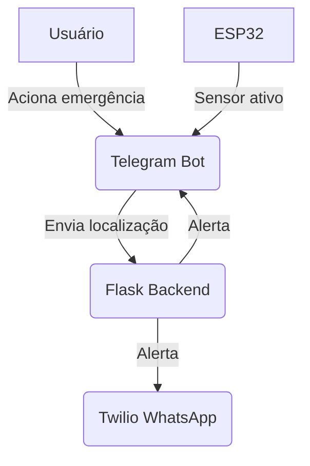

# 🚨 Sistema de Segurança Pessoal IoT

Um sistema de segurança pessoal baseado em **IoT** que permite acionar emergências rapidamente através de um aplicativo, integrando **localização em tempo real**, **comunicação instantânea** e **automação de iluminação** para aumentar a segurança do usuário.

---

## 📱 Funcionalidades

✅ **Bot no telegram**

* Registro de características do incidente.
* Exibição de locais menos iluminados no mapa para evitar durante a noite.

📍 **Geolocalização**

* Envio da localização em tempo real ao ser acionado (não implementado).

📨 **Notificações por Mensageria**

* Inicio de implementação de alertas via **WhatsApp** (Twilio), **Telegram** ou outros canais para contatos de emergência.

💡 **Integração com Iluminação Inteligente**

* Aumenta a visibilidade em ambientes menos iluminados.
* **Modo Presença:**

  * Ausência de movimento: luz baixa/desligada.
  * Presença detectada: luz alta.

---

## 🛠 Tecnologias Utilizadas

* **ESP32** (sensor de movimento e automação)
* **Python (Flask)** como backend
* **APIs de mensageria**

  * WhatsApp via **Twilio**
  * **Telegram Bot**
* Geolocalização com **GPS**
* Automação de iluminação inteligente

---

## 📂 Estrutura do Projeto

```
📁 esp-32
├── sensor-de-movimento.ino              # Código para ESP32 (sensor sem WiFi)
├── sensor-de-movimento_versao-com-wifi.ino  # Código para ESP32 (com WiFi)
📁 bot
├── app.py                               # Backend Flask com integração Telegram/WhatsApp
├── bot.py                               # Bot Telegram para captura de chat_id
├── README.md                            # Este arquivo
```

---

## 🚀 Como Funciona

1️⃣ O usuário aciona o **botão de emergência** no app.
2️⃣ O sistema envia a **localização em tempo real** para a central de monitoramento.
3️⃣ **Notificações instantâneas** são enviadas aos contatos de emergência via WhatsApp e Telegram.
4️⃣ O sistema de **iluminação inteligente** é ativado para aumentar a visibilidade no local.

---

## ⚙️ Configuração Rápida

### 🔌 1. Configurar ESP32

* Instale as bibliotecas necessárias no Arduino IDE.
* Configure o WiFi no código `sensor-de-movimento_versao-com-wifi.ino`.
* Carregue o código no ESP32.

### 🌐 2. Configurar Backend (Flask)

* Instale dependências Python:

  ```bash
  pip install python-telegram-bot twilio
  ```
* Edite `app.py` com suas credenciais:

  * `TELEGRAM_TOKEN`
  * `ACCOUNT_SID`, `AUTH_TOKEN` (Twilio)
  * `TWILIO_WHATSAPP_NUMBER`
  * `NUMERO_DESTINO`
* Execute:

  ```bash
  python app.py
  ```

### 🤖 3. Configurar Bot Telegram

* Crie o bot no Telegram com BotFather e obtenha o token.
* Insira o token em `bot.py`.
* Execute:

  ```bash
  python bot.py
  ```
* Envie `/start` no Telegram para obter seu `chat_id`.

---

## 💻 Fluxo do Sistema



---


